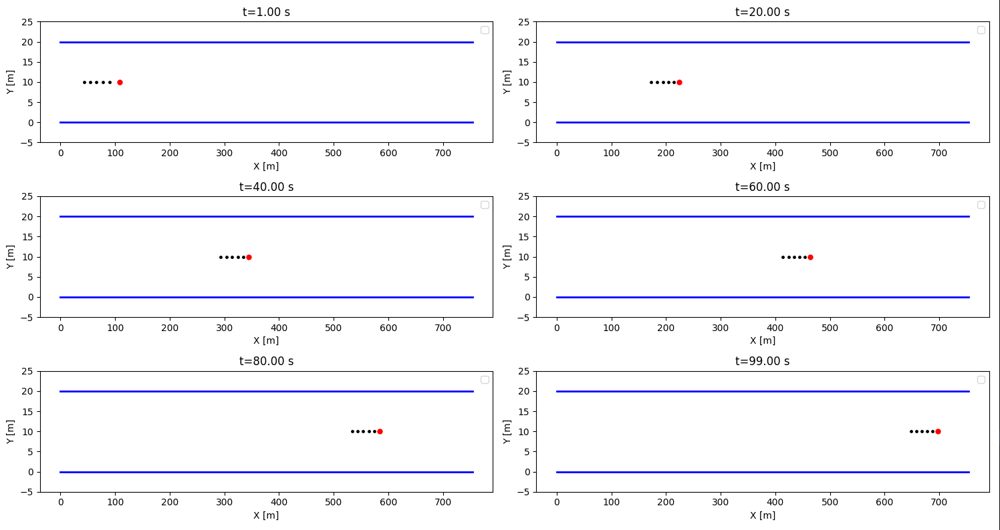
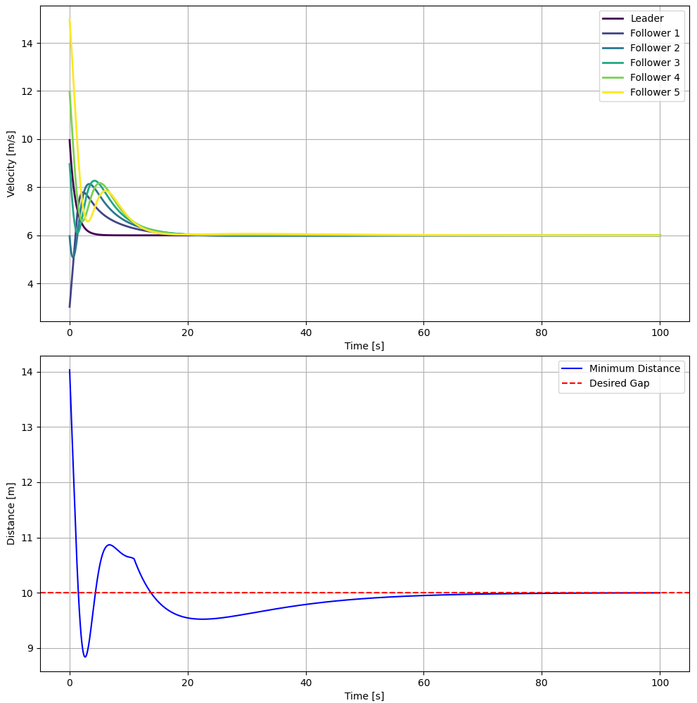
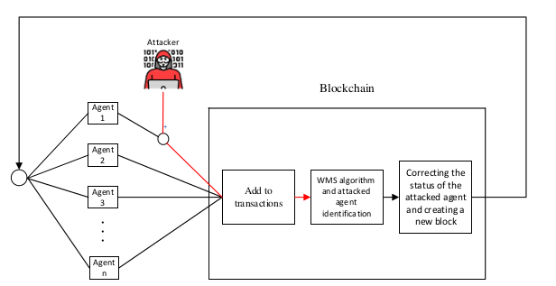
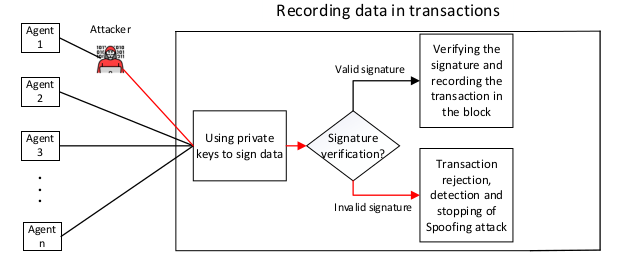
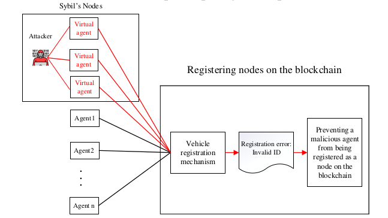

# AUT-MSc-Thesis-Resilient-control-of-Autonomous-Vehicles-using-Blockchain-against-Cyber Attacks
A project focused on implementing resilient control mechanisms for autonomous vehicles, using blockchain technology to mitigate cyber-attacks on sensors.

## Overview
This repository contains the code and documentation for the MSc project titled **"Resilient Control of Autonomous Vehicles under Cyber-Attacks against Sensors using Blockchain Technology"**. The project aims to develop and implement resilient control mechanisms for autonomous vehicles, leveraging blockchain technology to enhance security against various cyber-attacks on sensor systems.
# Platooning Algorithm for Autonomous Vehicles

## 1. Position Evolution of the Platoon
The following figure illustrates the position evolution of a platoon of autonomous vehicles over time. The black dots represent follower vehicles, while the red dot indicates the leader. The vehicles move within lane boundaries (blue lines) and maintain a coordinated formation. Over time, the platoon moves forward while preserving a stable formation.



## 2. Velocity and Distance Regulation
The velocity and inter-vehicle distance are key parameters in platoon stability. The top plot shows the velocity convergence of all vehicles in the platoon. Initially, vehicles exhibit fluctuations in speed as they adjust to maintain a safe distance from their leader. Over time, they stabilize at a uniform speed. The bottom plot represents the inter-vehicle distance. The blue curve shows the actual distance between vehicles, while the red dashed line represents the desired safe gap. The system ensures that the vehicles reach and maintain the optimal distance, preventing collisions while optimizing traffic flow.



## Features
- **Resilient Control Algorithms**: Adaptive control systems designed to maintain vehicle stability and performance under cyber-attack conditions.
- **Blockchain Integration**: Using blockchain technology to secure communication and data integrity among vehicle sensors and control units.
- **Cyber-Attack Mitigation**: Strategies and mechanisms to detect and counteract various types of cyber-attacks, such as Sybil, spoofing,FDI and distributed denial-of-service attacks(DDoS).

# Security Threats and Blockchain-based Mitigation

## 1. False Data Injection (FDI) Attack
FDI attacks involve an adversary injecting malicious data into the system to manipulate decision-making processes. The blockchain records transactions, applies the WMS algorithm for attack detection, and corrects the status of the attacked agent before creating a new block.



## 2. Spoofing Attack
In a spoofing attack, a malicious agent impersonates a legitimate node by signing data with an invalid signature. Blockchain-based signature verification ensures that only transactions with valid signatures are recorded, preventing spoofing attacks.



## 3. Sybil Attack
A Sybil attack occurs when an adversary creates multiple virtual agents to gain control over the network. The blockchain-based vehicle registration mechanism identifies invalid IDs and prevents malicious nodes from being registered.



## Project Structure
- `src/`: Contains the source code for the control algorithms and blockchain integration.
- `docs/`: Documentation and research papers related to the project.
- `simulations/`: Simulation scripts and results demonstrating the effectiveness of the proposed solutions.

## Installation
To get started with the project, clone the repository and install the necessary dependencies:
```bash
git clone https://github.com/yourusername/ResilientAV-Blockchain.git
cd ResilientAV-Blockchain
pip install -r requirements.txt
```
## Contributing
I welcome contributions from the community. If you have ideas for improvements or new features, please open an issue or submit a pull request. For major changes, please discuss them with me first by opening an issue.

## License
This project is licensed under the MIT License - see the LICENSE file for details.

## Contact
For questions or further information, please contact Saeed Aghamohammadi at Saeedaghamohammadi99@gmail.com
